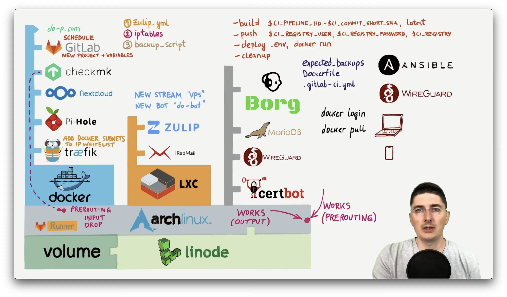
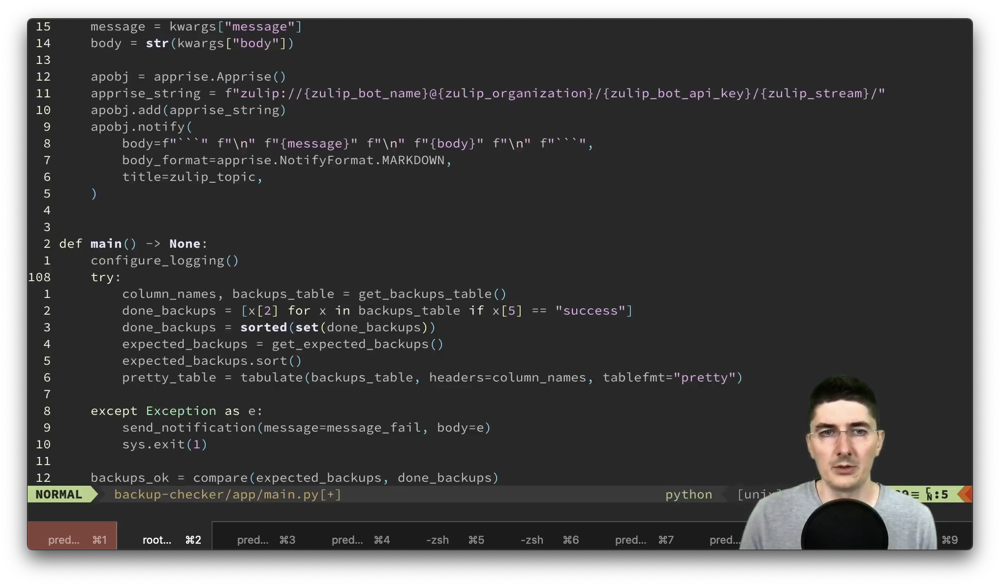

### Real world DevOps project from start to finish

 

These are the accompanying files for the the DevOps course I've created.

There should always be a 85% OFF coupon over at [sre.rs](https://sre.rs),
but you should also check if Udemy is offering a better discount at that moment.

All details are available on [Udemy](https://www.udemy.com/course/real-world-devops-project-from-start-to-finish/?referralCode=9AC467077593D22878A2) page, and I encourage you to watch the
"free preview" videos before purchasing the course. You can watch around 30 minutes for free, which should be enough to figure out if you like it or not.

#### Errata

Each directory contains `errata.md` so be sure to check that out.

#### Slides

You'll need Go's [present](https://pkg.go.dev/golang.org/x/tools/present) package.

Install [Go](https://go.dev/).

Install `present` package:
`go install golang.org/x/tools/cmd/present@latest`

`cd` into the directory where you've cloned this repository and run `present`.

#### Contributing

I'll probably accept only spelling corrections, wrong file names or similar, or if something affects security. The idea is not to deviate from the material in the videos.

Happy learning!
